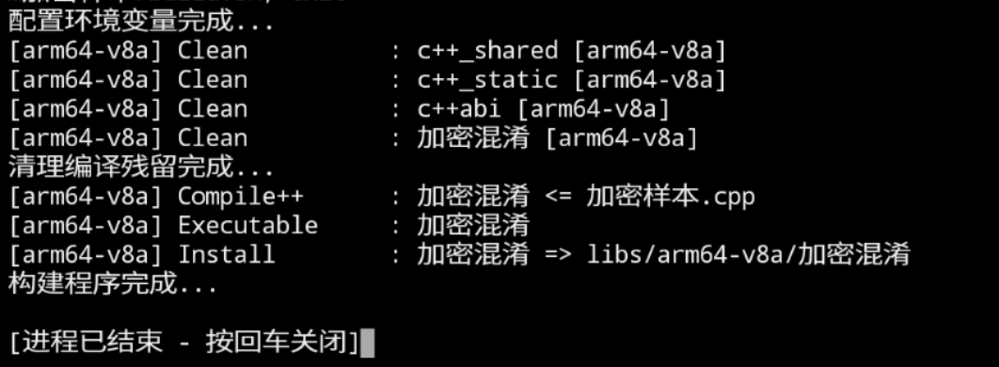

# android-ndk-r17-ollvm  阿夜
clang 9.0.1 的 编译工具链

 ## 使用方法 (必要组件)
  - 安装termux 不知道的动脑子百度
  - 手机Root 
  - 懂中文,看到的Chinese就行
  - github里面也有一份 很久之前录的视频 请傻瓜式操作
 # 注意事项 
1. 本编译链 使用了已发布的aarch64的编译链进行部分删减以及修改 使用该编译链后果由使用者自行承担 作者不参与以及增加恶意代码 
2. 编译链 目前分两个版本 开源于github的 为免费版本 免费版本和定制版本功能一样 无区别 只是编译时 describe 可以修改为定制 非专业人士,以及只需要简单的混淆加密 so/二进制 的作者 可不用关心
3. 当前版本使用 只需配合编译脚本使用即可


# 安装方法

1. 安装termux(然后更新一下配置 update upgrade 不懂得百度)
``` bash
pkg updata # 更新源列表
pkg upgrade # 更新源
```
2. 完成安装后下载对应的 ***android-ndk-r17-ollvm.zip*** 
3. 使用mt管理器 移动文件至 ```/data/data/com.termux/files/home/```
4. 修过编译连文件权限 7777 
```bash
chmod 7777 android-ndk-r17-ollvm.zip
```
5. 打开termux终端 使用unzip
```bash
unzip android-ndk-r17-ollvm.zip
``` 
命令解压 如果报错没有找到unzip 安装即可
```bash
pkg install unzip
``` 
6. 解压完成当前目录生成 **android-ndk-r17** 然后已经完成了一半了
7. 使用脚本编译就行,带脚本的*ndk-build*编译包自行下载  执行**build.sh**即可


 # 具体编译指令

 ``` mk
 LOCAL_PATH := $(call my-dir)

# 定义一个函数用于编译不同的模块
define build_module
include $(CLEAR_VARS)
LOCAL_SRC_FILES := $1
LOCAL_MODULE := $2

LOCAL_LDFLAGS += -llog -landroid

# 浅混淆 
#LOCAL_CPPFLAGS += -mllvm -sub -mllvm -fla -mllvm -split -mllvm -bcf -mllvm -sobf -mllvm -aesSeed=0x345678EDCRFVTGBYHNUJMIKOLPloveal
#LOCAL_CPPFLAGS += -mllvm -sub -mllvm -sub_loop=4 -mllvm -fla -mllvm -split -mllvm -split_num=4 -mllvm -bcf -mllvm -bcf_loop=2 -mllvm -bcf_prob=50 -mllvm -sobf -mllvm -aesSeed=0x345678EDCRFVTGBYHNUJMIKOLPloveal
LOCAL_CPPFLAGS += -std=c++14 -frtti -fexceptions -DANDROID_TOOLCHAIN=clang -ffunction-sections -fdata-sections -fpermissive -fvisibility=hidden -D__STDC_CONSTANT_MACROS -llog
LOCAL_CFLAGS += -fomit-frame-pointer -funroll-loops -ffast-math -fno-strict-aliasing -march=armv8-a+crc+crypto -mtune=cortex-a53 -mfpu=neon-fp-armv8 -ffunction-sections -fdata-sections -O3 -fomit-frame-pointer

include $(BUILD_EXECUTABLE)
endef

# 编译不同的模块
$(eval $(call build_module,加密样本.cpp,加密混淆))


 ```

 关键命令 剩下的就交给脚本 ***build.sh*** <br> 
 **-mllvm -sub -mllvm -sub_loop=4 -mllvm -fla -mllvm -split -mllvm -split_num=4 -mllvm -bcf -mllvm -bcf_loop=2 -mllvm -bcf_prob=50 -mllvm -sobf -mllvm -aesSeed=0x345678EDCRFVTGBYHNUJMIKOLPloveal** 
 <br>不懂就百度

 # 脚本解析
 ```bash
 # 配置环境变量  /data/data/com.termux/files/home/android-ndk-r17/ 这个一定是自己解压后的文件目录 跟着教程走就一定是这个目录
 export PATH=/data/data/com.termux/files/home/android-ndk-r17/:$PATH
echo "配置环境变量完成..."
#echo $PATH
ndk-build clean
echo "清理编译残留完成..."
ndk-build
echo "构建程序完成..."
 ```

 # 运行结果 

 ```bash
 配置环境变量完成...
[arm64-v8a] Clean          : c++_shared [arm64-v8a]
[arm64-v8a] Clean          : c++_static [arm64-v8a]
[arm64-v8a] Clean          : c++abi [arm64-v8a]
[arm64-v8a] Clean          : 加密混淆 [arm64-v8a]
清理编译残留完成...
[arm64-v8a] Compile++      : 加密混淆 <= 加密样本.cpp
[arm64-v8a] Executable     : 加密混淆
[arm64-v8a] Install        : 加密混淆 => libs/arm64-v8a/加密混淆
构建程序完成...

大概成功就这样子
 ```

 

 ## 混淆对比

### 无混淆
 .png)

### 浅混淆
.png)

### 深度混淆 (放大图)

.png)


### 深度混淆(鸟瞰图)

.png)

 - 非常变态

 最后 觉得还行就给个 **start** 关注一下 反馈邮箱 ***1773714466@qq.com***

 